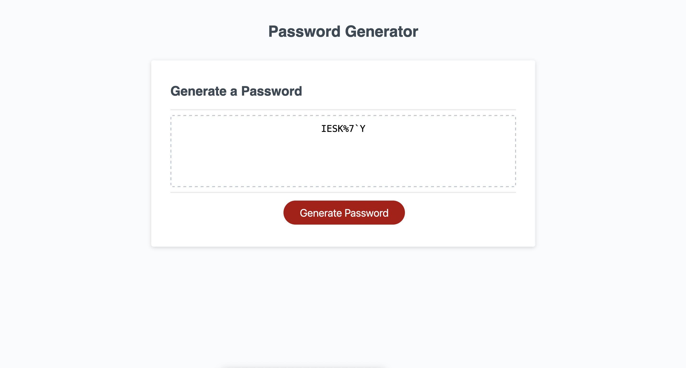

# PasswordGenerator

## Description

    The purpose of the project is to create a password generator that will create a passcode based on different types of letters. You need to have a knowledge of javascript html/css in order to use and install it. 

    In order to use such file, you would click on the generate password button in order for a password to be generated. Once the button is clicked several menus will appear thus enabling certain types of letters and numbers into the random generator.
    At the end you will have a randomly generated password in the window.

    The main motivation was to create a password generator that would take several parameters in its password generation.It helps the problem of secure password generation.By providing a user base with a methodology to generate random password with certain parameterization the user can create many passwords with a click of a button.

    I learned that creating programs is not a necesarrily laborious process and that coding can be fun when approached a certain way.

## Deployed link 

 The deployed link can be found at [deployed application](https://jjsr17.github.io/PasswordGenerator/)

## Github repo

The code for this app can be found here [app] (https://github.com/jjsr17/PasswordGenerator)

## App Thumbnail

]